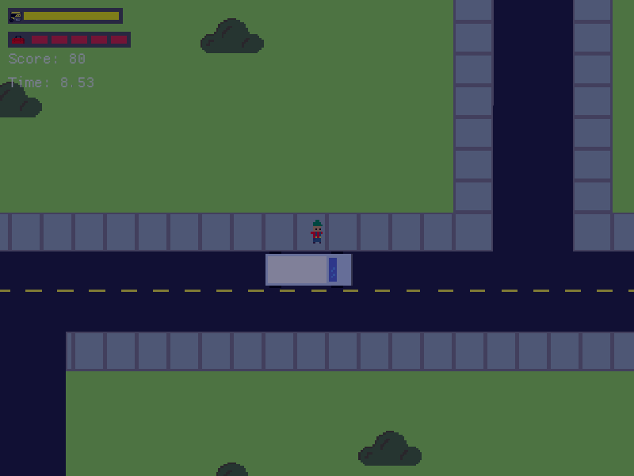
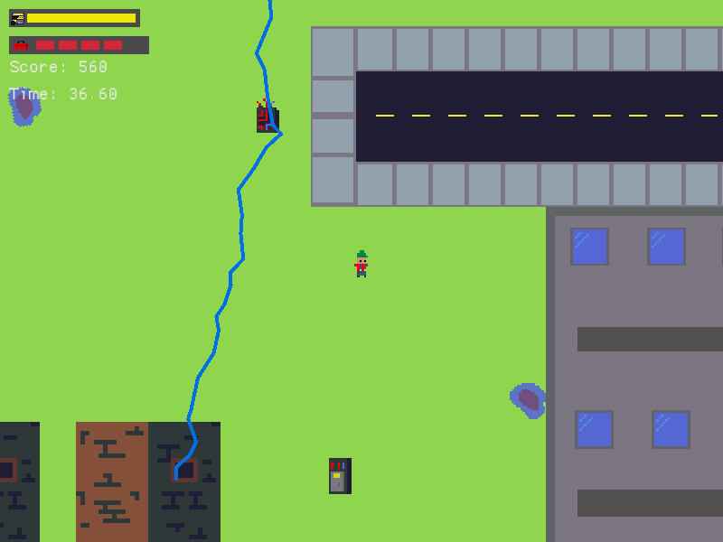
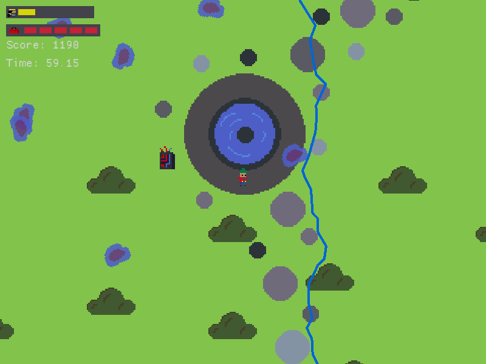
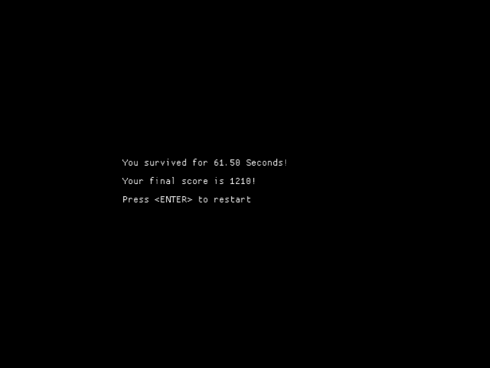

# power_crisis
## A project for olc CodeJam 2022

A severe thunderstorm is threatening a city!

You are an electrician tasked with keeping the city running.

Use < WASD > to move around and < SHIFT > to run.

Get close to your van to restock your repair kits.

Don't let the backup generator run out of fuel!

Good Luck!

